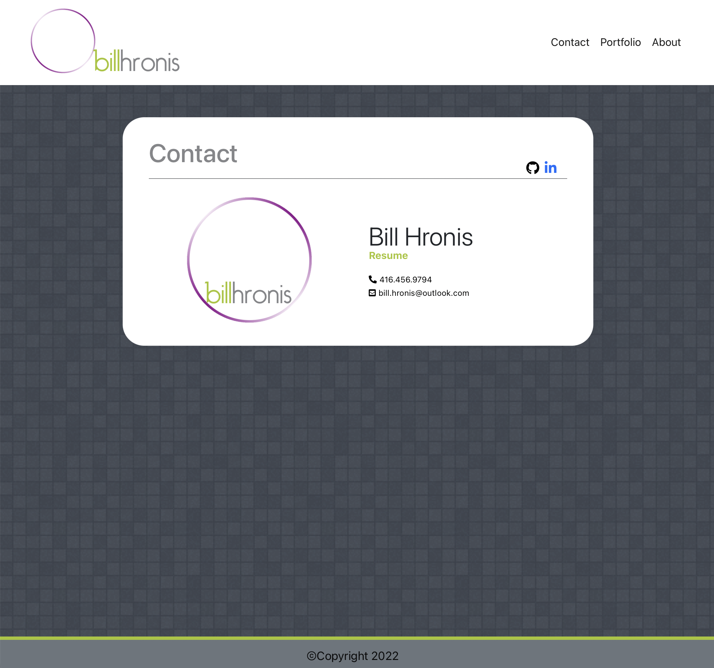
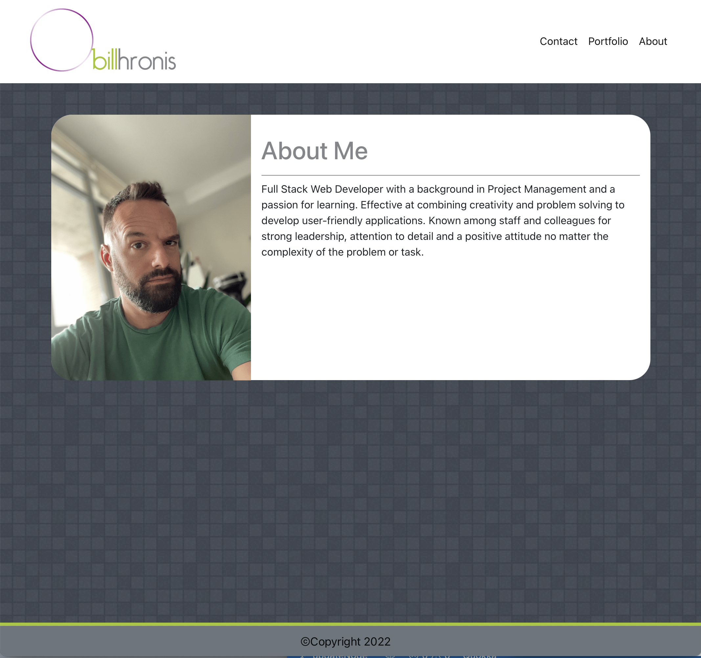

# bthReactPortfolio 
  

## Table of Contents 
- [bthReactPortfolio](#bthreactportfolio)
  - [Table of Contents](#table-of-contents)
  - [Description](#description)
  - [Installation Instructions](#installation-instructions)
  - [Usage](#usage)
  - [Licensing](#licensing)
  - [Contributing](#contributing)
  - [Tests Code](#tests-code)
  - [Images of the Appliication](#images-of-the-appliication)
  - [Access to Functional Applicaton](#access-to-functional-applicaton)
  - [GitHub Direct Link:](#github-direct-link)
  - [Questions](#questions)
    
## Description
    This application was designed to This application was designed using React.js to showcase projects I have worked on.
    
## Installation Instructions 
    There are no installation requirements required.   Clicking on the Heroku link will launch the application for use.

## Usage
    Please use this application to view work I have completed.  In addition, my bio and contact information are available which includes my resume.  Feel free to have a look and give me a shout.  I’m looking forward to applying my knowledge working on a new project, team and organization.
    
## Licensing
      

    
## Contributing
    I’m not looking for anyone to contribute to this application.  This application was designed by me and for me, to showcase my work.
    
## Tests Code
    To test, please launch the application on Heroku and feel free to click around on the links.  If you find any issues or errors, please let me know so that I can address them.

## Images of the Appliication
Please find screenshots and a brief video showcasing the application below

## Access to Functional Applicaton

A functioning version of the application can be found here [Heroku](https://bthreactportfolio.herokuapp.com/)

## GitHub Direct Link:  

[bthPortfolio--GitHub](https://github.com/daze77/ReactPortfolio)

    
## Questions
    
You can find me here on [GitHub](http://github.com/daze77), or contact me via [email](mailto:daze77@gmail.com)  
    